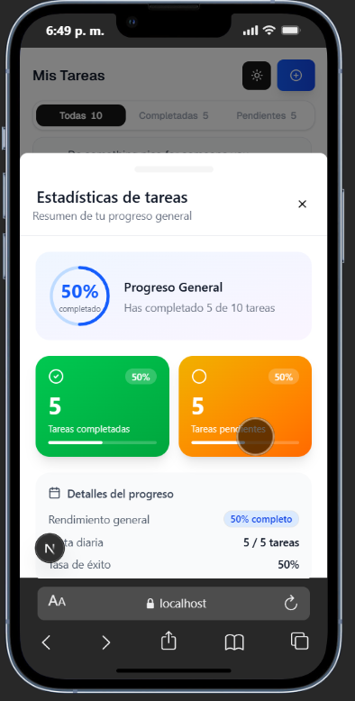
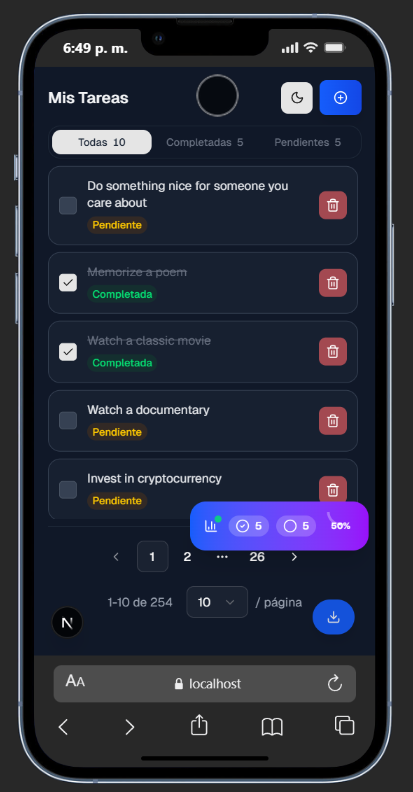

# TaskFlow

Aplicación de gestión de tareas construida con **Next.js 16**, **React 19**, **Tailwind CSS 4** y **Next-Pwa**.

Funciona como una PWA, permitiendo instalarla y usarla fácilmente en computadores, tablets y dispositivos móviles. 🚀

## Requisitos previos

- [Node.js](https://nodejs.org/) v18 o superior
- [pnpm](https://pnpm.io/) instalado globalmente

## ⚡Instalación y ejecución

Clona el repositorio:

```bash
git clone <https://github.com/YunierAyala2000/pt-taskflow-junier-ayala.git>
cd pt-taskflow-junier-ayala
```

## ⚡Ejecución

### Modo desarrollo

```bash
pnpm dev
```

El comando pnpm dev Instala las depencias y modulos y corre el proyecto
El servidor estará disponible en [http://localhost:3000](http://localhost:3000).

### Compilar para producción

```bash
pnpm build
```

### Iniciar en modo producción

```bash
pnpm start
```

### Formateadores Linter y Prettier

Estos se definieron para que todo el codigo tanga la misma estructura.
con este comando se formatean todos los archivos

```bash
pnpm lint
```

## 🖼️ Screenshots

### 🖥️ Escritorio


### 📱 Móvil — Modo claro




### 📱 Móvil — Modo oscuro




## 📂 Estructura del proyecto

```
pt-taskflow-junier-ayala/
├── app/                              # App Router de Next.js
│   ├── globals.css                   # Estilos globales con Tailwind
│   ├── layout.tsx                    # Layout raíz de la aplicación
│   └── page.tsx                      # Página principal
│
├── components/
│   ├── modal-add-task.tsx            # Modal/Drawer para agregar tareas
│   ├── task-item.tsx                 # Lista de tareas individuales
│   ├── task-stats.tsx                # Barra de estadísticas de tareas
│   ├── taskFilterTabs.tsx            # Tabs de filtro (Todas/Completadas/Pendientes)
│   │
│   ├── shared/                       # Componentes reutilizables globales
│   │   ├── AppPagination.tsx         # Paginación con selector de items por página
│   │   ├── ConfirmDialog.tsx         # Diálogo de confirmación genérico
│   │   ├── loader.tsx                # Indicador de carga animado
│   │   ├── PwaInstallButton.tsx      # Botón de instalación de la PWA
│   │   ├── task-empty.tsx            # Estado vacío cuando no hay tareas
│   │   ├── theme-provider.tsx        # Proveedor de tema claro/oscuro
│   │   └── theme-toggle.tsx          # Botón para alternar el tema
│   │
│   └── ui/                           # Componentes de shadcn/ui
│       ├── alert-dialog.tsx
│       ├── badge.tsx
│       ├── button.tsx
│       ├── checkbox.tsx
│       ├── dialog.tsx
│       ├── drawer.tsx
│       ├── input.tsx
│       ├── pagination.tsx
│       ├── select.tsx
│       └── sonner.tsx
│
├── hooks/                            # Hooks personalizados de React
│   ├── use-media-query.ts            # Detecta el tipo de dispositivo (móvil/escritorio)
│   └── use-task.ts                   # Lógica principal de tareas con SWR
│
├── services/                         # Servicios de lógica de negocio
│   └── task-services.ts              # Llamadas a la API de tareas
│
├── types/                            # Tipos e interfaces TypeScript
│   └── task-types.ts                 # Tipos para Task, TaskFilter, etc.
│
├── lib/                              # Utilidades compartidas
│   └── utils.ts                      # Función cn() para clases condicionales
│
└── public/                           # Archivos estáticos (imágenes, iconos, manifest)
    └── manifest.json                 # Configuración de la PWA
```

#### LIBRERIA USADA PARA FRONTEND shadcn/ui

Elegi esta libreria por que [shadcn/ui](https://ui.shadcn.com/) está diseñada específicamente para Tailwind. Por lo que facilita su uso e integracion.
Tambien por que es la cual no es cerrada y no se instala como una dependencia me baja una copia de los componentes y lo puedo modificar
sin restriccion algun por lo cual me parece ideal por que ya tiene funcionalidades y diseños muy utiles y es muy personalizable.

### COMPONENTES DESCARGADOS DE LA LIBRERIA SNADCD/UI

Para el desarrollo de la aplicación se seleccionaron diferentes componentes de la librería shadcn/ui, teniendo en cuenta criterios como adaptabilidad a múltiples dispositivos, facilidad de uso, accesibilidad y consistencia visual dentro de la interfaz.

A continuación se describen los componentes utilizados y su propósito dentro de la aplicación:

[Alert Dialog](https://ui.shadcn.com/docs/components/radix/alert-dialog): para mostrar confirmaciones antes de ejecutar acciones importantes, como eliminar o modificar elementos dentro de la aplicación.

[Input](https://ui.shadcn.com/docs/components/radix/input): para obtener los textos de los ingresados por el usuario en la App.

[Checkbox](https://ui.shadcn.com/docs/components/radix/checkbox): para gestionar el cambio de estado de las tareas, permitiendo marcar o desmarcar elementos completados.

[Button](https://ui.shadcn.com/docs/components/radix/button): para ejecutar acciones o eventos dentro de la interfaz, como guardar, eliminar o confirmar operaciones.

[Badge](https://ui.shadcn.com/docs/components/radix/badge): para resaltar iconos o textos.

[Dialog](https://ui.shadcn.com/docs/components/radix/dialog): para mostrar ventanas emergentes modales que mejoran la interacción del usuario tanto en dispositivos de escritorio como en móviles.

[Drawer](https://ui.shadcn.com/docs/components/radix/drawer): para usarlo cuando se detecte que esta en un dispositivo movil.

[Sonner](https://ui.shadcn.com/docs/components/radix/sonner): Para alertas o mensajes del sistema que informan al usuario sobre el resultado de una acción.

[Pagination](https://ui.shadcn.com/docs/components/radix/pagination)

[Select](https://ui.shadcn.com/docs/components/radix/select)

## HOOKS

### use-media-query:

Este hook se utiliza dentro de la aplicación para:

- Detectar si el usuario está utilizando un dispositivo móvil o escritorio.

- Cambiar dinámicamente componentes de la interfaz ( Drawer en móvil y Dialog en escritorio).

- Mejorar la experiencia de usuario en interfaces responsivas.

- Unificar lógica de media queries y evitar repetir código en múltiples componentes.

### use-task:

Es el núcleo de la lógica de tareas. Centraliza todo el estado, las peticiones a la API y las operaciones CRUD.

Expone todo lo necesario para que los componentes puedan listar, añadir, editar y eliminar tareas sin preocuparse por la lógica interna.

Responsabilidades:

- Gestiona el estado de paginación, filtros y lista local de tareas.
- Usa **SWR** para obtener tareas de la API con caché automático.
- Mantiene un registro de tareas creadas localmente (que la API no persiste) usando un `Set` de IDs en un `ref`.
- Expone las funciones `addTodo`, `toggleTodo` y `removeTodo` para que los componentes las consuman directamente.

##

## Archivos relacionados a `use-task.ts`

### `services/task-services.ts`

Contiene todas las funciones que se comunican con la API externa (`dummyjson.com/todos`). Está marcado con `"use server"` para que Next.js lo ejecute en el servidor, evitando exponer la URL base al cliente.

Funciones que expone:

| Función                          | Método HTTP | Descripción                      |
| -------------------------------- | ----------- | -------------------------------- |
| `getTasksPaginated(limit, skip)` | GET         | Obtiene tareas paginadas         |
| `addTask(payload)`               | POST        | Crea una nueva tarea             |
| `updateTask(id, payload)`        | PUT         | Actualiza el estado de una tarea |
| `removeTask(id)`                 | DELETE      | Elimina una tarea por ID         |

Internamente usa una función genérica `serverRequest<T>` que centraliza el manejo de errores y los headers comunes.

### `types/task-types.ts`

Define todos los tipos e interfaces TypeScript usados a lo largo del flujo de tareas. Garantiza consistencia entre la API, los servicios y los componentes.

| Tipo / Interfaz | Descripción                                                                                 |
| --------------- | ------------------------------------------------------------------------------------------- |
| `Task`          | Representa una tarea completa. Incluye `isLocal` para identificar tareas creadas en cliente |
| `AddTask`       | Payload para crear una tarea (sin `id`)                                                     |
| `UpdateTask`    | Payload para actualizar solo el campo `completed`                                           |
| `TaskResponse`  | Respuesta paginada de la API: `todos`, `total`, `skip`, `limit`                             |
| `TaskFilter`    | Union type: `"all"` \| `"completed"` \| `"pending"`                                         |

## Uso de SWR en el proyecto Para las Petciones y gestion de cache

En este proyecto se utiliza SWR como librería principal para la obtención y gestión de datos provenientes de la API.
Ya que este creado Vercel y esta muy optimizado para proyectos con Next.
Y es ideal para apps pequeñas gestion de cache y mas.

En caso de que el proyecto fuera mas grande lo ideal seria usar TanStack Query ya que este permite mutaciones de estado
mas avanzadas y un mejor manejo de cache

---

## ✨ Características extra

La aplicación incluye varias funcionalidades adicionales que mejoran la experiencia de uso y el rendimiento:

- 📄 Paginado de tareas
  Permite navegar fácilmente entre grandes cantidades de tareas sin afectar el rendimiento de la aplicación.

- 📱 Multiplataforma (PWA)
  La aplicación funciona como Progressive Web App, lo que permite instalarla y utilizarla en computadores, tablets y dispositivos móviles.

- 📊 Barra de estadísticas de tareas
  Visualización rápida del estado de las tareas para conocer de forma clara el progreso y organización del trabajo.

- ✨ Cambio de temas La app cuenta con un modo claro y oscuro

- ➤ Boton de contacto via whatsApp
